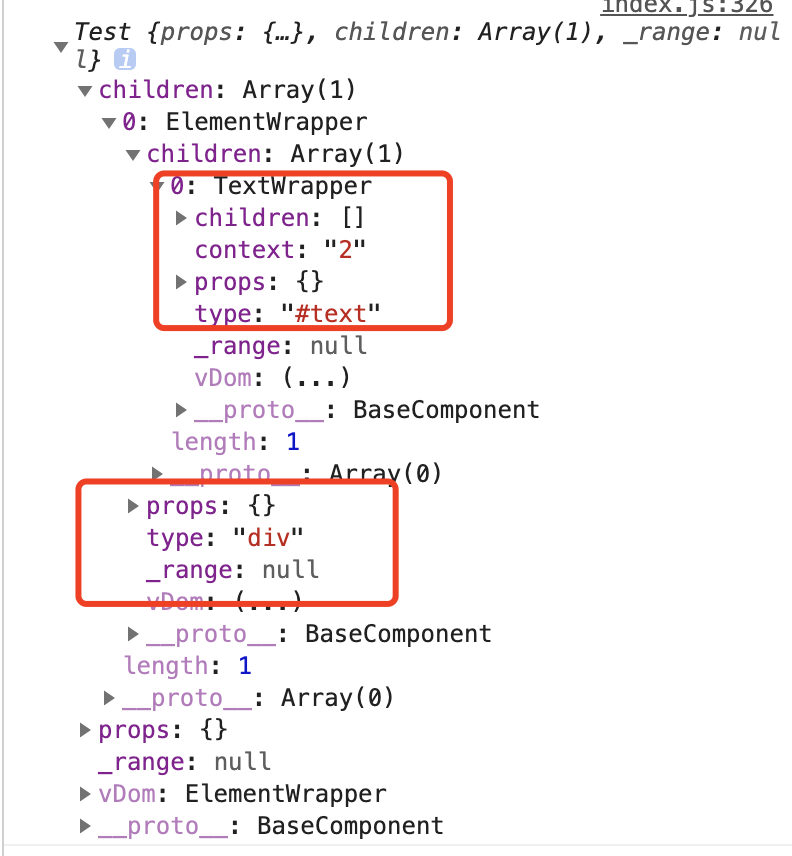

# toy-react

自己动手实现一个玩具版的 React。

## 一些问题

有几个问题需要自问：

1. Virtual DOM 的工作原理
2. React 与 Vue 在架构上有什么不同
3. 你怎么理解 MVC 框架呢？能不能举个例子说明

需要学习到的知识点：

1. 虚拟 DOM
2. JSX
3. 类组件
4. 函数组件
5. 事件
6. 组件生命周期
7. MVC
8. Hooks

## 开始实现 ToyReact

### 前置准备 node

本地环境需要安装 nodejs（[下载地址](https://nodejs.org/en/)）

### 初始化项目

```bash
  npm init -y
```

在生成后的文件中输入自己的项目的信息

### 配置 webpack + babel

需要明白的一个基础知识是：React 框架不被浏览器原生支持，所以源码必须要经过事先编译后，再进行生产部署，我们使用常见的构建工具 webpack，配合目前最流行的代码转译工具 babel 实现编译(这里的编译更像是翻译)。

安装 webpack

```bash
npm install -D webpack webpack-cli
```

安装 babel

```bash
npm install -D @babel/core @babel/preset-env babel-loader
```

这里是一份可用的 [webpack 配置](./webpack.config.js)

其中配置一段配置是想要让编译后的代码方便阅读

```javascript
  mode: 'none',
  optimization: {
    minimize: false,
  }
```

如果是真实项目中使用应该配置为:

```javascript
  mode: 'production',
  optimization: {
    minimize: true,
  }
```

这里是 [babel 配置](./babel.config.js)

本项目中 prettier + eslint 部分仅是为了方便编码使用，可以不关心，有兴趣请自行学习，babel 部分同样。

### 启动编译

创建一个 src/index.js，随便输入一段测试代码，然后在 npm scripts 配置中新增编译命令

```JSON
"scripts": {
  "build": "webpack"
},
```

控制台执行 npm run build ，dist/index.js 生成，引入 html 中检查，使用正常。

### 添加 JSX 支持

JSX 是 React 框架使用的一个核心模块，虽然 React 官方强调可以不写 JSX，但是那种方式编写代码十分麻烦，所以还是以 JSX 为主。

在 index.js 中写入一段 JSX 代码，如果不添加其他插件支持编译会报错，需要增加插件 @babel/plugin-transform-react-jsx（配置见 babel.config.js）

```javascript
let a = (
  <div id="1" className="2">
    <div>1</div>
    <div>2</div>
  </div>
);
```

经过编译后的代码为：

```javascript
let a = React.createElement(
  'div',
  {
    id: '1',
    className: '2',
  },
  React.createElement('div', null, '1'),
  React.createElement('div', null, '2')
);
```

可以看到一段 JSX 代码经过解析后变为了一段函数调用，默认该函数是 React.createElement，接收的第一个参数是元素名字符串，第二个参数是元素具有的属性，后面的其他参数都是第一个元素的子元素，以此类推。

可以修改 @babel/plugin-transform-react-jsx 插件的 pragma 配置，改为你任意想要的函数名。

### 实现 createElement

createElement 的具体实现可以查看文件[create-element.js](./src/react/create-element.js)

需要说明的是函数的第一个参数 type 具有多种类型，例如元素节点类型'div'，自定义组件 ‘MyComponent’ 等

React 中默认大写开头的元素是自定义组件，所以 div 和 Div 是不同的。

### 包装 Wrapper

为了自定义组件和元素组件的表现形式统一，需要对元素组件也包装一个 Class 出来，包装后的几个类可以见 [base-component.js](./src/react/module/base-component.js) 和 [wrapper-component.js](./src/react/module/wrapper-component.js)。

包装出来的元素节点类和文本节点类都需要继承组件基类，保证具备几乎相同的事件和属性。

### 渲染函数

在程序的运行阶段，每一个组件变量在声明并赋值时，都会通过 createElement 产生一个 AST 树，但是在真正渲染前就只是 AST 树，没有真实的节点。

通过一个渲染函数将组件中的内容真正的添加到 html 的元素中，具体实现见[render.js](./src/react/render.js)

因此你就可以理解为什么只有在 ElementWrapper 和 TextWrapper 的 \[RENDER_TO_DOM\] 函数中，才有 document.createElement() 和 document.createTextNode()，这样生成真正 Dom 结构的东西。

### 真实节点渲染方式（中间过程，最后会被虚拟 Dom 方式取代）

JSX 语法被解析后，通过调用 createElement 函数生成一个对象。 createElement 函数调用时，如果传入的第一个参数的类型是 'div' 时，通过 new ElementWrapper() 调用构造函数然后由 document.createElement(type) 生成一个空的 dom 节点。

如果子节点传入的是字符串文字，通过 new TextWrapper() 调用构造函数然后由 document.createTextNode() 生成一个文本节点，最后递归的方式生成一个带有层级嵌套的 dom 节点，赋值给声明的对象。

```xml
<div>
  <div></div>
  123
</div>
```

最后执行 render 函数，向 html 模板中的真实节点中插入该节点，渲染出页面。

### 添加生命周期

借助 Range Api 对目标位置的 Dom 做添加和删除操作，在 Component 组件上添加 setState 函数支持，在子组件中通过调用 setState 修改数据，然后重新触发 render。

只有自定义组件有生命周期，所以每个自定义组件初始化的时候都会创建一个 Range 并保存下来。

元素组件只有在添加子元素的时候会创建一个 Range 用来存储，渲染后被收回。

### 收集属性

前面已经说过，一个通过 JSX 语法编写的组件，被翻译后最终的表现形式是调用 createElement 函数，函数结果赋值给一个变量，你可以看上面"添加 JSX"支持的例子。

我们在元素节点上绑定的 id="1" 和 className = "2" 最终会作为 createElement 函数的第二个参数传递进去，在 createElement 函数的实现中，这个参数被认为是当前这个元素的属性，用于描述元素的某些特性。

在函数执行阶段，创建一个该组件的实例，然后通过实例的 setAttribute 函数将所有属性收集。

如果你对原生 JavaScript 十分熟悉，那么想必你对 setAttribute 函数也不会陌生，但是在这里你需要转换一下你的概念。我们知道在 JavaScript 中，通过 document.createElement 可以创建一个 Dom 节点对象，调用这个 Dom 对象的 setAttribute 函数可以将属性挂载到对象上，然后添加到页面中去。这种是通过真实 Dom 的方式来渲染页面，不是虚拟 Dom。

所以在 React 中，我们通过上面提到的包装 Wrapper，让 Wrapper 类也具备 setAttribute 函数属性，这样就可以在逻辑上统一。当然如果为了便于区分，避免混淆设置和收集的概念，你可以将除了 ElementWrapper 下 \[RENDER_TO_DOM\] 函数以外的所有 setAttribute 改为 collectAttribute 。

这样你就知道了，只有在真正 render 渲染的时候，才是设置，其他所有阶段都只是进行收集。

### 收集子节点

与上面提到的 setAttribute 函数一样，在程序中出现的 appendChild 除了在真正的 render 阶段，都应该是意外着收集节点，你可以将 appendChild 改为 collectChild。

所以这样就不难理解了，在执行 createElement 阶段就是在做属性和子节点的收集，然后构造出一个复杂的对象，即 AST 树。

### 虚拟 Dom 树构建

到目前为止，你应该知道了在执行渲染之前我们会生成一个 AST 树，那么它到底长什么样呢？

```javascript
class Test extends Component {
  render() {
    return (
      <div>
        <span>1</span>
        {this.children}
      </div>
    );
  }
}
console.log(
  <Test>
    <div>2</div>
  </Test>
);
```

在打印上面的自定义 Test 之前，让我们根据代码来分析一下应该有哪些内容输出：

1. 输出的整体是一个 Test 对象，由于没有在 Test 标签后添加任何属性，所以其 props 属性应该是一个空对象
2. Test 标签里包裹了一个 div, 所以猜测其 children 属性下有一个 类型 type 为 ‘div’ 的 ElementWrapper，而 div 里包裹的 '2'将是该 div 节点的子节点，类型 type 是 '#text'， 值为 2。
3. \_range 为空，因为目前没有执行真正的渲染，不知道它的上层节点位置

分析到这里，我们可以暂停下来，执行程序检查结果

正如我们预料输出了一个 Test。那么你会问了，AST 树在哪里呢？

在进行这一步内容的扩展时，我需要你思考一个问题：html 中的节点类型有多少种？我们常见的或者说可以在页面里看见的有多少种？

这里给你一份资料，如果你不知道的话可以看一下[nodeType-MDN](https://developer.mozilla.org/en-US/docs/Web/API/Node/nodeType)

我们编写程序时，一般也只关注元素节点和文本节点，所以最终往页面上进行渲染的时候，一定是这两个类型的组合。

现在来看刚刚输出的 Test 对象，对象下的 vDom 属性就是我们要找的 AST 树。

在代码中 vDom 是通过 getter 关键字定义的一个函数属性，该属性在被访问的时候返回数据。

如果我们访问的组件是一个元素组件，那么 vDom 将返回自身组件实例，并且如果具有子元素节点，也会将子元素节点挂载到实例的 vChildren 属性上，代码见 wrapper-component.js 的 14 行。

如果我们访问的是一个自定义组件，那么 vDom 将调用 render 函数返回调用后的结果，如果 render 时得到的还是一个自定义组件，那么将继续调用 render，直到最终获得的是元素节点或者文本节点，代码见 base-component.js 的 23 行。

如果访问的是一个文本节点，直接返回文本节点本身，文本节点不可能存在子节点，所以内容很简单。

所以我们最终得到的就是一个嵌套类型 type 是'元素类'或者文本类的 AST 树。

### 延迟渲染

最终的渲染函数请见[render.js](./src/react/render.js)

执行时调用组件的\[RENDER_TO_DOM\] 函数，向父元素的 range 中添加真实的 Dom 节点。

当需要渲染的节点是自定义组件生成的节点时，将该节点层级下虚拟 Dom
取出，然后递归生成 元素节点或者文本节点。

再次强调，添加到页面上的节点只可能是元素节点或者文本节点。而且根据函数的特性，你不可能直接渲染一个没有父元素的文本节点出来。

比如 React.render('123', document.getElementById('root')),'123' 将被理解为一个字符串。

再比如

```javascript
class Demo extends Component {
  render() {
    return '123';
  }
}
```

这种都是不被允许的。在 React 中，你需要用一个父元素包裹，可以是 div 这样的元素标签，也可以是自定义组件，如果你不想在文本节点上生成多余的节点，你可以使用官方的 React.Fragments。这样才能形成一个有层级结构的语法树出来。

### Diff 算法

React 框架的核心是数据驱动视图变化，数据发生变化时，怎么改变视图是 Diff 算法的最终体现。

简单的来说：一个节点的 type 类型如果变化，则认为是新节点；如果节点属性数量发生变化，或者属性的值发生变化，则认为是新节点；如果节点是文件节点，文本内容发生变化，则认为是新节点，等等。

当然 React 官方的实现逻辑更加优秀也更加复杂，需要进一步学习。

### 对以上内容总结

1. 我们需要封装一个组件基类，当组件类型是自定义组件时，这个自定义组件需要继承自组件基类
2. 我们需要封装一个元素节点类和一个文本节点类，同样需要继承组件基类
3. 在构建编译阶段， JSX 的插件将 JSX 语法翻译成函数的形式，然后在运行时通过函数调用赋值到变量上保存
4. JSX 翻译后的函数 createElement 在调用时会收集作用在该组件上的属性和子节点，最后返回一个节点对象
5. render 阶段取出节点对象中的虚拟 Dom 树，创建文本节点和元素节点，最终渲染到页面中
6. 用户产生行为，或者数据发生变化时，调用 setState 函数比对数据然后重新渲染组件
7. 渲染真实 Dom 借助了 Range Api，好处是不管该节点渲染在什么地方 ，总能通过该实例保存的 \_range 进行相应变化的处理

## 回答开头的问题
